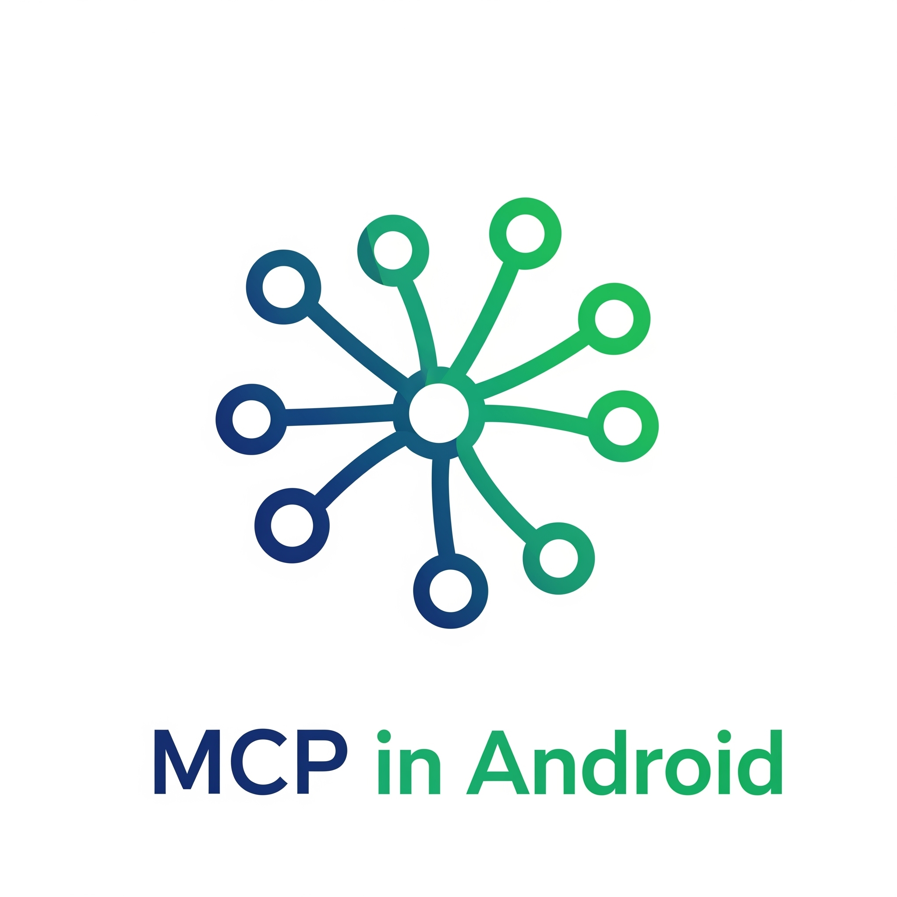
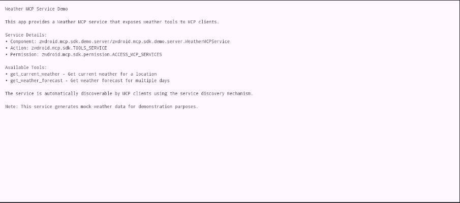
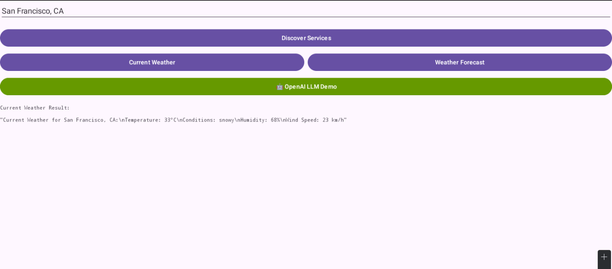
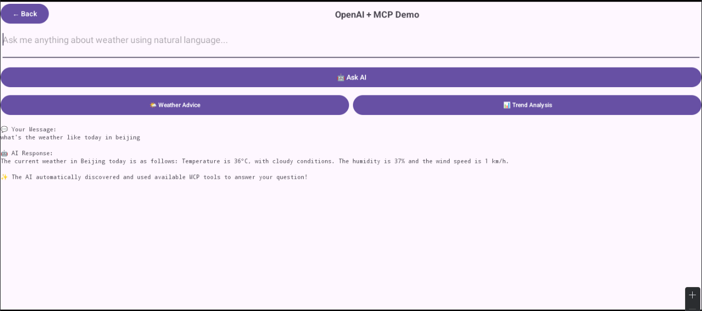

<p align="center">
  
</p>

# Android MCP SDK

[](https://android.com)
[](https://kotlinlang.org)
[](LICENSE)
[](https://android-arsenal.com/api?level=24)
[](https://jitpack.io/#AnswerZhao/android-mcp-sdk)


🚀 **Android-MCP SDK**: The Bridge Between LLMs and the Android App Ecosystem.

> Extending the official MCP and using AIDL for transport, this SDK breaks down the isolation between AI agents and native Android applications. 
> Whether you're building an LLM to orchestrate tools or an app to be invoked by AI, this SDK is your essential toolkit.

[中文版README](README_zh.md) | [🚀 Quick Start](#-quick-start)

## ✨ What Makes This Special

**Transform Your Android Ecosystem into LLM Superpowers**

```kotlin
// Your LLM can now do this across ANY Android app:
val result = mcpHost.callTool(
    "com.weather.app/.WeatherService#get_forecast",
    buildJsonObject { put("location", JsonPrimitive("Tokyo")) }
)

// And this:
mcpHost.callTool("com.calendar.app/.CalendarService#add_event", eventData)

// And this:
mcpHost.callTool("com.camera.app/.PhotoService#take_picture", cameraSettings)
```

### 🎯 Perfect For

- **🤖 AI App Developers**: Build LLM assistants that control the entire Android ecosystem
- **📱 Android Developers**: Expose your app's capabilities to the growing AI assistant market  
- **🏢 Enterprise Teams**: Create unified AI interfaces for internal Android app suites
- **🔬 Researchers**: Prototype cross-app AI interactions and automation workflows

## 💡 The Problem We Solve

**Current State**: Your LLM is trapped in a single app
- ❌ Cannot access other Android apps' capabilities
- ❌ Each app exists in isolation  
- ❌ Limited to built-in functions only
- ❌ No standard way for apps to expose AI-callable functions

**With Android MCP SDK**: Your LLM becomes a system-wide AI assistant
- ✅ **Cross-App Communication**: Call functions from any MCP-enabled Android app
- ✅ **Automatic Discovery**: Find available tools across the entire system
- ✅ **Secure by Design**: Android-native permission system with flexible policies
- ✅ **Production Ready**: Built on Android's robust AIDL/Binder IPC architecture
- ✅ **Zero App Changes**: Existing apps can add MCP support without architectural changes

## 🚀 Quick Start

### Server App Integration (Tool Provider)

**1. Add Dependency**
```gradle
dependencies {
    implementation("com.github.AnswerZhao:android-mcp-sdk:v0.0.1")
    implementation("io.modelcontextprotocol:kotlin-sdk:0.6.0")
}

maven { url = uri("https://jitpack.io") }
```

**2. Create Your MCP Service**
```kotlin
class WeatherMcpService : McpService() {
    override fun getImplementation() = Implementation("weather-service", "1.0.0")
    
    override fun getServerOptions() = ServerOptions(
        capabilities = ServerCapabilities(tools = ServerCapabilities.Tools(listChanged = true))
    )

    override fun registerTools(server: Server) {
        server.addTool(
            name = "get_current_weather",
            description = "Get current weather for a location"
        ) { request ->
            val location = request.arguments["location"]?.jsonPrimitive?.content
            CallToolResult(content = listOf(TextContent("Weather in $location: Sunny, 25°C")))
        }
    }
}
```

**3. Declare in AndroidManifest.xml**
```xml
<service android:name=".WeatherMcpService" android:exported="true" android:permission="zwdroid.mcp.sdk.permission.ACCESS_MCP_SERVICES">
    <intent-filter>
        <action android:name="zwdroid.mcp.sdk.McpServerService" />
    </intent-filter>
    <meta-data android:name="mcp.description" android:value="Weather tools service" />
    <meta-data android:name="mcp.tools" android:resource="@raw/mcp_tools" />
</service>
```

### Client App Integration (LLM Consumer)

**1. Add Dependency**
```gradle
dependencies {
    implementation("com.github.AnswerZhao:android-mcp-sdk:v0.0.1")
    implementation("io.modelcontextprotocol:kotlin-sdk:0.6.0")
}

maven { url = uri("https://jitpack.io") }
```

**2. Call Tools from Your LLM**
```kotlin
val mcpHost = McpHost.getInstance(context)

// Discover available tools
val tools = mcpHost.listMcpServers()

// Call a specific tool
val result = mcpHost.callTool(
    "com.example.weather/.WeatherMcpService#get_current_weather",
    buildJsonObject { put("location", JsonPrimitive("San Francisco, CA")) }
)
```

**3. Add Permissions**
```xml
<uses-permission android:name="zwdroid.mcp.sdk.permission.ACCESS_MCP_SERVICES" />
<queries>
    <intent>
        <action android:name="zwdroid.mcp.sdk.McpServerService" />
    </intent>
</queries>
```

## 📱 Sample Apps

This repository includes two fully functional demo apps:

### 🌤️ Weather Server App (`android-mcp-server`)
- Provides weather tools (`get_current_weather`, `get_weather_forecast`)
- Demonstrates flexible security policies
- Shows proper tool registration and error handling

### 🤖 LLM Client App (`android-mcp-client`) 
- OpenAI GPT integration example
- Real-time tool discovery and calling
- Clean MVVM architecture with Jetpack Compose UI

<p align="center">
  
  
  
</p>

**Try it yourself:**
```bash
./gradlew :android-mcp-server:installDebug
./gradlew :android-mcp-client:installDebug
```

## 🏗️ How It Works

### Simple Concept
**Imagine a voice assistant app that can control your entire phone:**

```
🎤 "Hey Assistant, what's the weather in San Francisco?"
   ↓
🤖 Voice App → calls → 🌤️ Weather App (via MCP) → returns weather data

🎤 "Add a meeting for tomorrow at 3 PM"  
   ↓
🤖 Voice App → calls → 📅 Calendar App (via MCP) → creates event

🎤 "Take a photo and set it as wallpaper"
   ↓  
🤖 Voice App → calls → 📸 Camera App (via MCP) → captures photo
             → calls → 🎨 Settings App (via MCP) → sets wallpaper
```

**Before Android MCP SDK**: Each app works in isolation
**With Android MCP SDK**: One AI assistant can control all your apps

### Technical Foundation
**Built on proven Android technologies:**
- **[Model Context Protocol](https://modelcontextprotocol.io/)** - Industry standard for LLM-tool communication
- **[Official MCP Kotlin SDK](https://github.com/modelcontextprotocol/kotlin-sdk)** - We extend this with Android capabilities
- **Android AIDL/Binder IPC** - System-level, secure cross-process communication
- **Android Service Architecture** - Standard Android patterns you already know

### Architecture Overview
```
🤖 LLM Application
    ↓ (McpHost)
📱 MCPClientManager → Discovers Services
    ↓ (AIDL/Binder IPC)
🔧 McpService (Your App) → Exposes Tools
    ↓ (Standard MCP)
⚙️ Your App Functions
```

**Key Benefits:**
- **🚀 5-minute integration** - Add MCP support to existing Android apps
- **🔒 Production security** - Built-in permission system with 5 security policies  
- **⚡ High performance** - Efficient Binder IPC with async coroutines
- **🛠️ Zero dependencies** - Apps only need the lightweight SDK

### Core Design Principles
- **Security-First**: Android-native permission system with flexible access control
- **Performance-Optimized**: Coroutines-based async operations, efficient resource management
- **Developer-Friendly**: Intuitive APIs, extensive documentation, working examples
- **Production-Ready**: Comprehensive error handling, lifecycle management, memory leak prevention
```
LLM Application → McpHost → MCPClientManager → MCPClient → BinderClientTransport 
                                                              ↓
                                                          AIDL/Binder IPC
                                                              ↓
BinderServerTransport → McpServer → McpService ← Your Implementation
```

### Core Design Principles
- **🔒 Security-First**: Configurable permission policies (Open, Permission-based, Signature-based, Whitelist, Custom)
- **⚡ Performance-Optimized**: Coroutines-based async operations, efficient resource management
- **🧩 Modular Design**: Clean separation between transport, client, server, and common components  
- **🛡️ Production-Ready**: Comprehensive error handling, lifecycle management, memory leak prevention
- **🎯 Developer Experience**: Intuitive APIs, extensive documentation, working examples

### Technology Stack
- **[MCP Kotlin SDK 0.6.0](https://github.com/modelcontextprotocol/kotlin-sdk)** - Official MCP protocol implementation
- **Android AIDL/Binder IPC** - Cross-process communication foundation
- **Kotlin 2.2.0** with Coroutines for async operations
- **Kotlinx Serialization** for efficient JSON handling

## 📖 Documentation

- 🛠️ [**Development Guide**](CLAUDE.md) - Internal development instructions

## 🤝 Community & Contribution

We welcome contributions from the community! Here's how you can get involved:

### 🐛 Issues
- Report bugs using our [issue template](.github/ISSUE_TEMPLATE.md)
- Request features or enhancements
- Ask questions about usage or implementation

### 🔧 Pull Requests
1. Fork the repository
2. Create your feature branch (`git checkout -b feature/amazing-feature`)
3. Commit your changes (`git commit -m 'Add amazing feature'`)
4. Push to the branch (`git push origin feature/amazing-feature`)
5. Open a Pull Request

### 📖 Documentation
- Improve existing documentation
- Add code examples and tutorials
- Translate documentation to other languages

### 🎯 Development Setup
```bash
git clone https://github.com/your-username/android-mcp-sdk.git
cd android-mcp-sdk
./gradlew build
```

## 📄 License

This project is licensed under the MIT License - see the [LICENSE](LICENSE) file for details.

## 🙏 Acknowledgments

- [**Model Context Protocol**](https://modelcontextprotocol.io/) for the excellent protocol specification
- [**Official MCP Kotlin SDK**](https://github.com/modelcontextprotocol/kotlin-sdk) - This Android SDK extends their foundational work
- **Android Team** for the robust AIDL/Binder IPC mechanism

---

<p align="center">
  <strong>Built with ❤️ for the Android & AI community</strong><br>
  <sub>Extending the official MCP Kotlin SDK with Android AIDL/Binder support</sub>
</p>