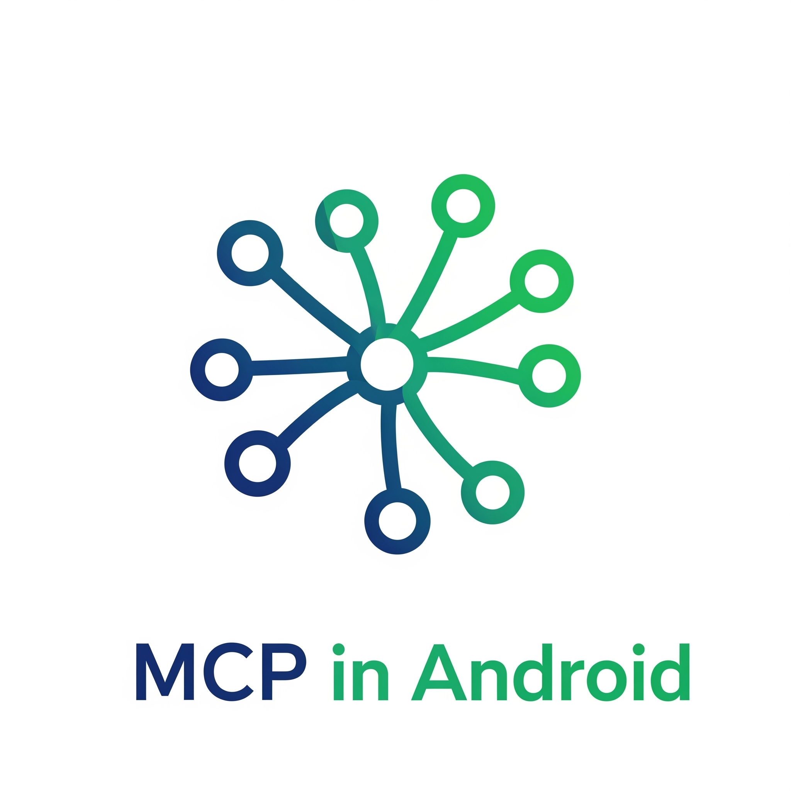
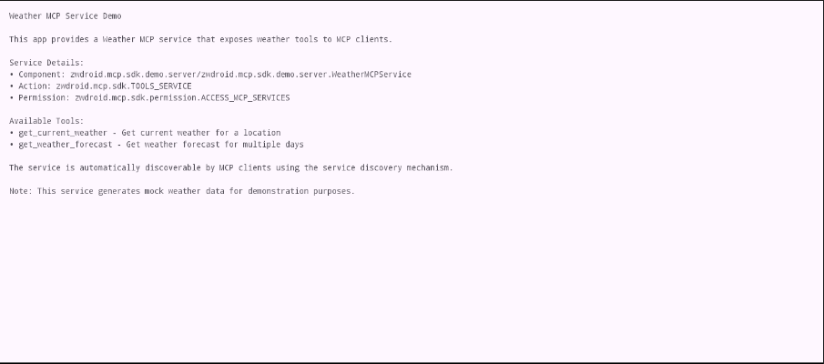
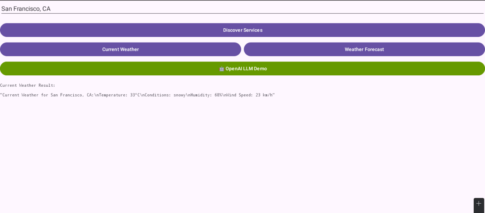

<p align="center">
  
</p>

# Android MCP SDK

[](https://android.com)
[](https://kotlinlang.org)
[](LICENSE)
[](https://android-arsenal.com/api?level=24)
[](https://jitpack.io/#AnswerZhao/android-mcp-sdk)

🚀 **Android-MCP SDK**：为大模型（LLMs）与安卓生态，架起沟通的桥梁。

> 立足于官方 MCP 协议之上，以 AIDL 为纽带，让 AI 代理与原生应用从此再无壁垒，融为一体。
> 无论您的创想是构建一个运筹帷幄的 AI 大脑，还是让您的应用化身为 AI 的得力臂助，本 SDK 都将是这一切的实现引擎。

[English README](README.md) | [🚀 快速开始](#-快速开始)

## ✨ 独特优势

**将您的 Android 生态系统转化为 LLM 超能力**

```kotlin
// 您的 LLM 现在可以跨任何 Android 应用执行以下操作：
val result = mcpHost.callTool(
    "com.weather.app/.WeatherService#get_forecast",
    buildJsonObject { put("location", JsonPrimitive("东京")) }
)

// 还有这些：
mcpHost.callTool("com.calendar.app/.CalendarService#add_event", eventData)

// 以及这些：
mcpHost.callTool("com.camera.app/.PhotoService#take_picture", cameraSettings)
```

### 🎯 适用对象

- **🤖 AI 应用开发者**：构建能够控制整个 Android 生态系统的 LLM 助手
- **📱 Android 开发者**：将您的应用能力暴露给不断增长的 AI 助手市场
- **🏢 企业团队**：为内部 Android 应用套件创建统一的 AI 接口
- **🔬 研究人员**：原型开发跨应用 AI 交互和自动化工作流

## 💡 我们解决的问题

**当前状态**：您的 LLM 被困在单一应用中
- ❌ 无法访问其他 Android 应用的功能
- ❌ 每个应用各自孤立存在
- ❌ 仅限于内置函数功能
- ❌ 应用暴露 AI 可调用函数没有标准方式

**使用 Android MCP SDK**：您的 LLM 成为系统级 AI 助手
- ✅ **跨应用通信**：调用任何启用 MCP 的 Android 应用中的函数
- ✅ **自动发现**：在整个系统中查找可用工具
- ✅ **安全设计**：Android 原生权限系统，具有灵活策略
- ✅ **生产就绪**：基于 Android 强大的 AIDL/Binder IPC 架构
- ✅ **零应用更改**：现有应用可以在不改变架构的情况下添加 MCP 支持

## 🚀 快速开始

### 服务端应用集成（工具提供者）

**1. 添加依赖**
```gradle
dependencies {
    implementation("com.github.AnswerZhao:android-mcp-sdk:v0.0.1")
    implementation("io.modelcontextprotocol:kotlin-sdk:0.6.0")
}

maven { url = uri("https://jitpack.io") }
```

**2. 创建您的 MCP 服务**
```kotlin
class WeatherMcpService : McpService() {
    override fun getImplementation() = Implementation("weather-service", "1.0.0")
    
    override fun getServerOptions() = ServerOptions(
        capabilities = ServerCapabilities(tools = ServerCapabilities.Tools(listChanged = true))
    )

    override fun registerTools(server: Server) {
        server.addTool(
            name = "get_current_weather",
            description = "获取指定位置的当前天气"
        ) { request ->
            val location = request.arguments["location"]?.jsonPrimitive?.content
            CallToolResult(content = listOf(TextContent("$location 的天气：晴朗，25°C")))
        }
    }
}
```

**3. 在 AndroidManifest.xml 中声明**
```xml
<service android:name=".WeatherMcpService" android:exported="true" android:permission="zwdroid.mcp.sdk.permission.ACCESS_MCP_SERVICES">
    <intent-filter>
        <action android:name="zwdroid.mcp.sdk.McpServerService" />
    </intent-filter>
    <meta-data android:name="mcp.description" android:value="天气工具服务" />
    <meta-data android:name="mcp.tools" android:resource="@raw/mcp_tools" />
</service>
```

### 客户端应用集成（LLM 消费者）

**1. 添加依赖**
```gradle
dependencies {
    implementation("com.github.AnswerZhao:android-mcp-sdk:v0.0.1")
    implementation("io.modelcontextprotocol:kotlin-sdk:0.6.0")
}

maven { url = uri("https://jitpack.io") }
```

**2. 从 LLM 中调用工具**
```kotlin
val mcpHost = McpHost.getInstance(context)

// 发现可用工具
val tools = mcpHost.listMcpServers()

// 调用特定工具
val result = mcpHost.callTool(
    "com.example.weather/.WeatherMcpService#get_current_weather",
    buildJsonObject { put("location", JsonPrimitive("旧金山，加州")) }
)
```

**3. 添加权限**
```xml
<uses-permission android:name="zwdroid.mcp.sdk.permission.ACCESS_MCP_SERVICES" />
<queries>
    <intent>
        <action android:name="zwdroid.mcp.sdk.McpServerService" />
    </intent>
</queries>
```

## 📱 示例应用

本仓库包含两个完全功能的演示应用：

### 🌤️ 天气服务端应用 (`android-mcp-server`)
- 提供天气工具（`get_current_weather`、`get_weather_forecast`）
- 演示灵活的安全策略
- 展示正确的工具注册和错误处理

### 🤖 LLM 客户端应用 (`android-mcp-client`) 
- OpenAI GPT 集成示例
- 实时工具发现和调用
- 采用 Jetpack Compose UI 的简洁 MVVM 架构

<p align="center">
  
  
  
</p>

**亲自尝试：**
```bash
./gradlew :android-mcp-server:installDebug
./gradlew :android-mcp-client:installDebug
```

## 🏗️ 工作原理

### 简单概念
**想象一个能够控制您整部手机的语音助手应用：**

```
🎤 "嘿助手，旧金山的天气怎么样？"
   ↓
🤖 语音应用 → 调用 → 🌤️ 天气应用 (通过 MCP) → 返回天气数据

🎤 "明天下午3点添加一个会议"  
   ↓
🤖 语音应用 → 调用 → 📅 日历应用 (通过 MCP) → 创建事件

🎤 "拍张照片并设为壁纸"
   ↓  
🤖 语音应用 → 调用 → 📸 相机应用 (通过 MCP) → 拍摄照片
             → 调用 → 🎨 设置应用 (通过 MCP) → 设置壁纸
```

**使用 Android MCP SDK 之前**：每个应用各自孤立工作
**使用 Android MCP SDK 之后**：一个 AI 助手可以控制您的所有应用

### 技术基础
**基于成熟的 Android 技术构建：**
- **[模型上下文协议](https://modelcontextprotocol.io/)** - LLM-工具通信的行业标准
- **[官方 MCP Kotlin SDK](https://github.com/modelcontextprotocol/kotlin-sdk)** - 我们在此基础上扩展 Android 能力
- **Android AIDL/Binder IPC** - 系统级、安全的跨进程通信
- **Android 服务架构** - 您已经熟悉的标准 Android 模式

### 架构概览
```
🤖 LLM 应用
    ↓ (McpHost)
📱 MCPClientManager → 发现服务
    ↓ (AIDL/Binder IPC)
🔧 McpService (您的应用) → 暴露工具
    ↓ (标准 MCP)
⚙️ 您的应用功能
```

**关键优势：**
- **🚀 5分钟集成** - 为现有 Android 应用添加 MCP 支持
- **🔒 生产安全** - 内置权限系统，提供 5 种安全策略
- **⚡ 高性能** - 高效的 Binder IPC 与异步协程
- **🛠️ 零依赖** - 应用只需要轻量级 SDK

### 核心设计原则
- **安全优先**：Android 原生权限系统，具有灵活的访问控制
- **性能优化**：基于协程的异步操作，高效的资源管理
- **开发友好**：直观的 API、详尽的文档、可运行示例
- **生产就绪**：全面的错误处理、生命周期管理、内存泄漏预防
```
LLM 应用 → McpHost → MCPClientManager → MCPClient → BinderClientTransport 
                                                        ↓
                                                    AIDL/Binder IPC
                                                        ↓
BinderServerTransport → McpServer → McpService ← 您的实现
```

### 核心设计原则
- **🔒 安全优先**：可配置的权限策略（开放、基于权限、基于签名、白名单、自定义）
- **⚡ 性能优化**：基于协程的异步操作，高效的资源管理
- **🧩 模块化设计**：传输、客户端、服务端和通用组件的清晰分离
- **🛡️ 生产就绪**：全面的错误处理、生命周期管理、内存泄漏预防
- **🎯 开发者体验**：直观的 API、详尽的文档、可运行示例

### 技术栈
- **[MCP Kotlin SDK 0.6.0](https://github.com/modelcontextprotocol/kotlin-sdk)** - 官方 MCP 协议实现
- **Android AIDL/Binder IPC** - 跨进程通信基础
- **Kotlin 2.2.0** 与协程用于异步操作
- **Kotlinx Serialization** 用于高效 JSON 处理

## 📖 文档

- 🛠️ [**开发指南**](CLAUDE.md) - 内部开发说明

## 🤝 社区与贡献

我们欢迎社区贡献！以下是您可以参与的方式：

### 🐛 问题反馈
- 使用我们的 [问题模板](.github/ISSUE_TEMPLATE.md) 报告 bug
- 请求新功能或改进建议
- 询问使用或实现相关问题

### 🔧 拉取请求
1. Fork 仓库
2. 创建您的功能分支 (`git checkout -b feature/amazing-feature`)
3. 提交更改 (`git commit -m 'Add amazing feature'`)
4. 推送到分支 (`git push origin feature/amazing-feature`)
5. 打开拉取请求

### 📖 文档贡献
- 改进现有文档
- 添加代码示例和教程
- 将文档翻译为其他语言

### 🎯 开发环境设置
```bash
git clone https://github.com/your-username/android-mcp-sdk.git
cd android-mcp-sdk
./gradlew build
```

## 📄 许可证

本项目采用 MIT 许可证 - 详情请见 [LICENSE](LICENSE) 文件。

## 🙏 致谢

- [**Model Context Protocol**](https://modelcontextprotocol.io/) 提供了优秀的协议规范
- [**官方 MCP Kotlin SDK**](https://github.com/modelcontextprotocol/kotlin-sdk) - 此 Android SDK 扩展了他们的基础工作
- **Android 团队** 提供了稳健的 AIDL/Binder IPC 机制

---

<p align="center">
  <strong>为 Android 和 AI 社区用 ❤️ 构建</strong><br>
  <sub>扩展官方 MCP Kotlin SDK，增加 Android AIDL/Binder 支持</sub>
</p>